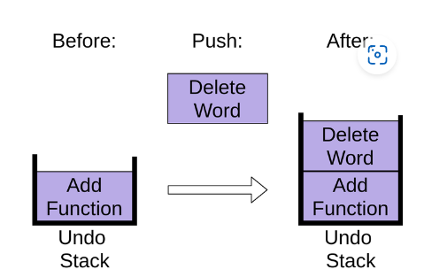
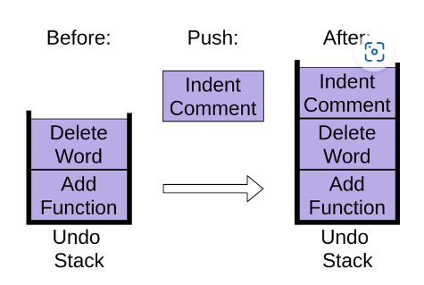
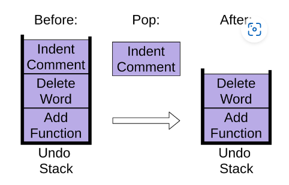
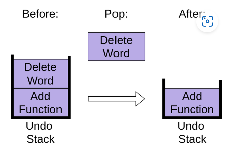
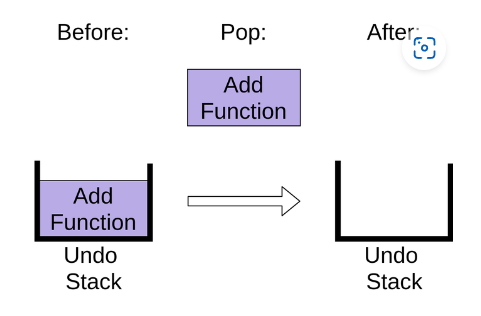

## Stacks 

<div style="margin-top: 20px; margin-bottom: 20px;">
  
</div>


A stack is a data structure that follows the **Last-In-First-Out (LIFO)** principle, where the last element added to the stack is the first one to be removed. 

Stacks are commonly used in programming for managing function calls, undo operations, and parsing expressions.

### Stack Operations

#### Push Operation
- The push operation adds an element to the top of the stack. Syntax: `push(item)`

#### Pop Operation
- The pop operation removes and returns the top element from the stack. Syntax: `pop()`

#### Peek Operation
- The peek operation returns the top element from the stack without removing it.  Syntax: `peek()`

#### Is Empty Operation
- The is empty operation checks if the stack is empty.Syntax: `is_empty()`

#### Size Operation
- The size operation returns the number of elements in the stack. Syntax: `size()`

### Example: Stack Operations
Here's an example of implementing a stack in Python using the built-in list data structure:

```python
# Define a class named Stack to represent a stack data structure
class Stack:
    # Constructor to initialize an empty stack
    def __init__(self):
        self.items = []  # Initialize an empty list to store stack elements

    # Method to push (add) an item onto the top of the stack
    def push(self, item):
        self.items.append(item)  # Append the item to the end of the list (top of the stack)

    # Method to pop (remove and return) the top item from the stack
    def pop(self):
        if not self.is_empty():  # Check if the stack is not empty
            return self.items.pop()  # Remove and return the last item from the list (top of the stack)
        else:
            raise IndexError("pop from empty stack")  # Raise an IndexError if pop is called on an empty stack

    # Method to peek (return) the top item from the stack without removing it
    def peek(self):
        if not self.is_empty():  # Check if the stack is not empty
            return self.items[-1]  # Return the last item from the list (top of the stack)
        else:
            return None  # Return None if the stack is empty

    # Method to check if the stack is empty
    def is_empty(self):
        return len(self.items) == 0  # Return True if the list (stack) is empty, False otherwise

    # Method to return the number of items in the stack
    def size(self):
        return len(self.items)  # Return the length of the list (number of items in the stack)

# Example usage
stack = Stack()
stack.push(1)
stack.push(2)
stack.push(3)
print(stack.pop())  # Output: 3
print(stack.peek())  # Output: 2
print(stack.size())  # Output: 2
```


### "Undo" Option

One of the practical applications of stacks is implementing the "undo" functionality in applications. 

For example, when you perform an action (e.g., typing, deleting), the action is pushed onto the stack. If the user wants to undo the action, the most recent action (top of the stack) is popped off, reverting the state.

### Example: Undo Operation

Suppose you are working on a text editor application and want to implement the "undo" functionality using a stack.

```python
class TextEditor:
    def __init__(self):
        self.content = ""
        self.undo_stack = []

    def add_text(self, text):
        self.content += text
        self.undo_stack.append(("add", text))

    def delete_last_character(self):
        if len(self.content) > 0:
            deleted_char = self.content[-1]
            self.content = self.content[:-1]
            self.undo_stack.append(("delete", deleted_char))

    def undo(self):
        if len(self.undo_stack) > 0:
            operation, value = self.undo_stack.pop()
            if operation == "add":
                self.content = self.content[:-len(value)]
            elif operation == "delete":
                self.content += value

# Example usage
editor = TextEditor()
editor.add_text("Hello, ")
editor.add_text("world!")
print(editor.content)  # Output: Hello, world!
editor.delete_last_character()
print(editor.content)  # Output: Hello, world
editor.undo()
print(editor.content)  # Output: Hello, world!
```


### Diagrams and Tables

This table illustrates the operations and performance of stacks. 

| Stack Operation | Description                                     |
|-----------------|-------------------------------------------------|
| push(item)      | Adds an item to the top of the stack            |
| pop()           | Removes and returns the top item from the stack |
| peek()          | Returns the top item without removing it        |
| is_empty()      | Checks if the stack is empty                    |
| size()          | Returns the number of items in the stack        |


Table 1: Description of Stack Operations


<div style="display:flex; margin-bottom:10px;">
    
    
    
</div>

Fig.1,2,3: Demostrate Stack push operation
<div style="display:flex;">
    
    
    
</div>

Fig.4,5,6: Demostrate Stack pop operation

### Problem to Solve

Write a Python function to reverse a string using a stack. Implement the function `reverse_string(string)` that takes a string as input and returns the reversed string using a stack data structure.

For example:

Input: "hello"
Output: "olleh"
Input: "python"
Output: "nohtyp"
Input: "stacks"
Output: "skcats"


### Problem Solution
You can check your code with the solution here: [Solution](reverse_string.py)


[Back to Welcome Page](0-welcome.md)