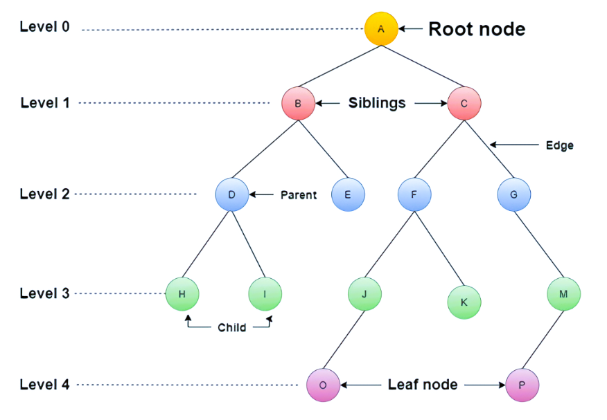

# Trees

<div style="margin-top: 20px; margin-bottom: 20px;">
  
</div>

## Introduction
In this section, we'll delve into the concept of Trees in data structures. Trees are hierarchical data structures composed of **nodes**, where each node can have zero or more child nodes.

Trees are widely used in computer science and are the foundation for various tree-based algorithms and data structures.

## Binary Trees
A binary tree is a type of tree where each node can have at most two children, commonly referred to as the **left child and the right child**. Binary trees play a crucial role in many tree-based algorithms and applications due to their simple yet powerful structure.

## BST Operations
A Binary Search Tree (BST) is a type of binary tree that maintains the BST property, which states that for each node:
- The left subtree contains only nodes with values less than the node's value.
- The right subtree contains only nodes with values greater than the node's value.

BST operations include insertion, deletion, searching for a key, and traversing the tree in various orders (inorder, preorder, postorder).

## Diagrams, and Tables

| BST Operation        | Description                                        | Performance (Big O)                                      |
|----------------------|----------------------------------------------------|-----------------------------------------------------------|
| insert(value)        | Insert a value into the tree.                      | Average: O(log n) <br> Worst case: O(n)                    |
| remove(value)        | Remove a value from the tree.                      | Average: O(log n) <br> Worst case: O(n)                    |
| contains(value)      | Determine if a value is in the tree.               | Average: O(log n) <br> Worst case: O(n)                    |
| traverse_forward     | Visit all objects from smallest to largest.        | O(n) - Recursively traverse the left subtree and then the right subtree. |
| traverse_reverse     | Visit all objects from largest to smallest.        | O(n) - Recursively traverse the right subtree and then the left subtree. |
| height(node)         | Determine the height of a node.                    | O(n) - Recursively find the height of the left and right subtrees and then return the maximum height (plus one to account for the root). |
| size()               | Return the size of the BST.                        | O(1) - The size is maintained within the BST class.       |
| empty()              | Returns true if the root node is empty.            | O(1) - The comparison of the root node or the size.       |
| balance()   | Balances the BST to maintain its structural integrity   | O(n log n) Average case, due to balancing operations.               |

In this table, each BST operation is described along with its corresponding Big O notation for performance. The performance is stated in terms of average and worst-case scenarios where applicable. Note that the actual performance can vary based on the BST's structure and the specific implementation of each operation.


Table 1: Description of BST Operations


<div style="margin-top: 60px; margin-bottom: 20px;">
  
</div>

Fig.1: Tree Representation

## Examples
#### Example 1: Check Balanced Tree
```python
def is_balanced(root):
    def get_height(node):
        if node is None:
            return 0
        left_height = get_height(node.left)
        right_height = get_height(node.right)
        return max(left_height, right_height) + 1
    
    def check_balanced(node):
        if node is None:
            return True
        left_height = get_height(node.left)
        right_height = get_height(node.right)
        if abs(left_height - right_height) > 1:
            return False
        return check_balanced(node.left) and check_balanced(node.right)
    
    return check_balanced(root)

# Example usage
root_balanced = Employee(50, "Balanced Tree")
root_balanced.left = Employee(25, "Left Child")
root_balanced.right = Employee(75, "Right Child")
root_balanced.left.left = Employee(10, "Left Left Child")
root_balanced.left.right = Employee(30, "Left Right Child")

print(is_balanced(root_balanced))  # Output: True (the tree is balanced)
```
In this example, the problem of checking if a BST is balanced involves recursively calculating the height of each node's left and right subtrees and ensuring that the heights differ by at most one. The is_balanced function uses helper functions to calculate heights and check balance recursively, returning True if the tree is balanced and False otherwise.

#### Example 2: Searching Operation in BST
```python
def search_key(root, key):
    if root is None or root.key == key:
        return root
    
    if key < root.key:
        return search_key(root.left, key)
    else:
        return search_key(root.right, key)

# Example usage
result_node = search_key(root, 40)
if result_node:
    print(f"Node found with key {result_node.key}") # Output: Node found with key 40
else:
    print("Node not found")
```
In this example, we demonstrate the searching operation in a Binary Search Tree (BST). We define the search_key function to search for a node with a given key in the BST. If the node is found, we print its key; otherwise, we print a message indicating that the node was not found.


### Problem to Solve 

Write a function to find and return the minimum value/key in a Binary Search Tree (BST).

### Problem Solution
You can check your code with the solution here: [Solution](tree_solution_problem.py)

[Back to Welcome Page](0-welcome.md)